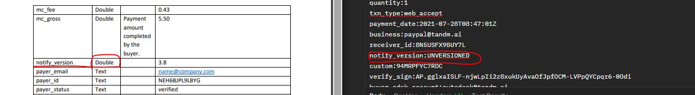
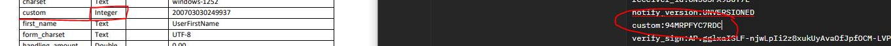
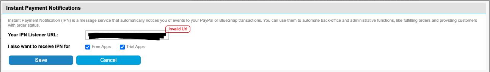

# An very awesome experience of integrating a IPN service

## Intro

Have you ever felt that only raising two middle finger and swearing the **F** words isn't really enough to express the calm and peace in your heart? 

To be more specific..., you know what, just give a glimpse.

## TL;DR


Enjoy:






> I have to say, never seen a documents are beautifully composed, accurate and consistent. 


---

## What Happened

Lately, I've been tasked to work on an Instant Payment Notification with a service that my company is using. Having read through their document, the first thing I do is to map all the properties in their payload. 

I thought the implementation should be smooth and nice given that I got 99% of the information from the doco. However, the nightmare only begins from me uploading the endpoint to their IPN listener entry. 

At first, it starts giving me an Invalid error of my URL, which I tested it is healthy. 

I scratched my head of not knowing what goes wrong. Therefore I contacted their support. Funny thing is, even the support guy doesn't know what goes wrong and I kept giving him a hint whether their ```Upload``` method has some sort of check. After pulling another colleague of his to confirm there's a dummy test to my endpoint. 

Brilliant!!! Such a good idea. Ok, fine. So I went back to see what goes wrong for my endpoint. Upon checking on logs, realize all my properties are ```null```. So, what did I do wrong? Kept digging around my code to find out what went wrong. Local **Postman** to call and debug couldn't find out what goes wrong. 

Then I decided to pull out a Http Request Logging middleware, checking the incoming raw request. 

Ha, found out that there's a hidden property not listed in the document called ```test_ipn_connection``` which sent with the dummy test call. No wonder all my properties are null. 

Then, the rest are just good find over the lengthy log checking and digging. I have to say, never seen a documents are beautifully composed, accurate and consistent. 

