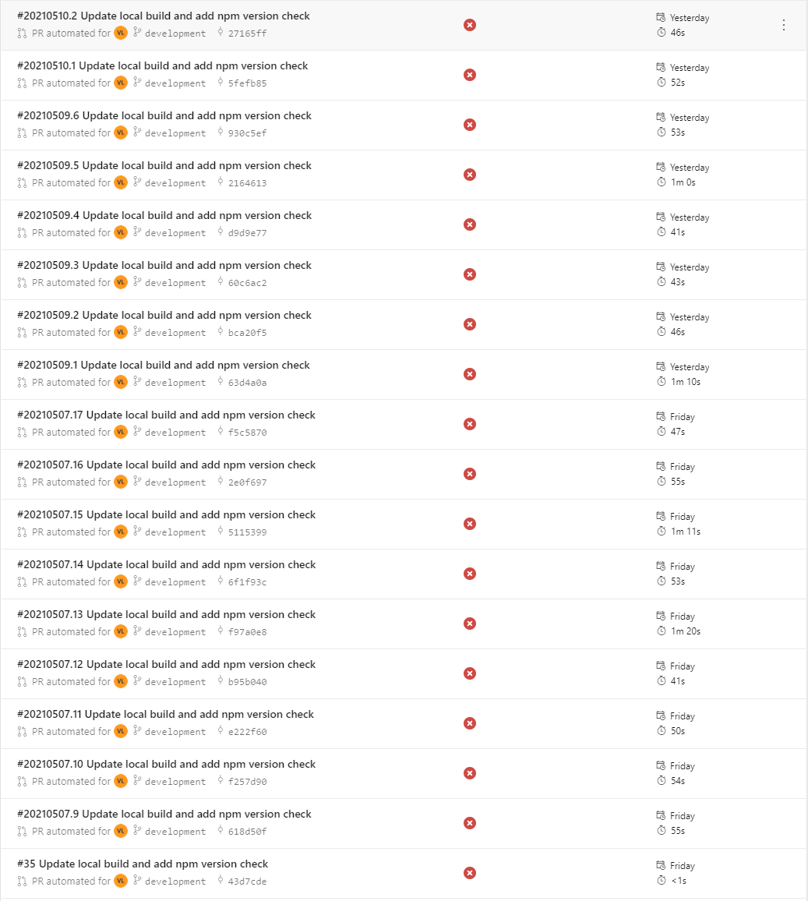
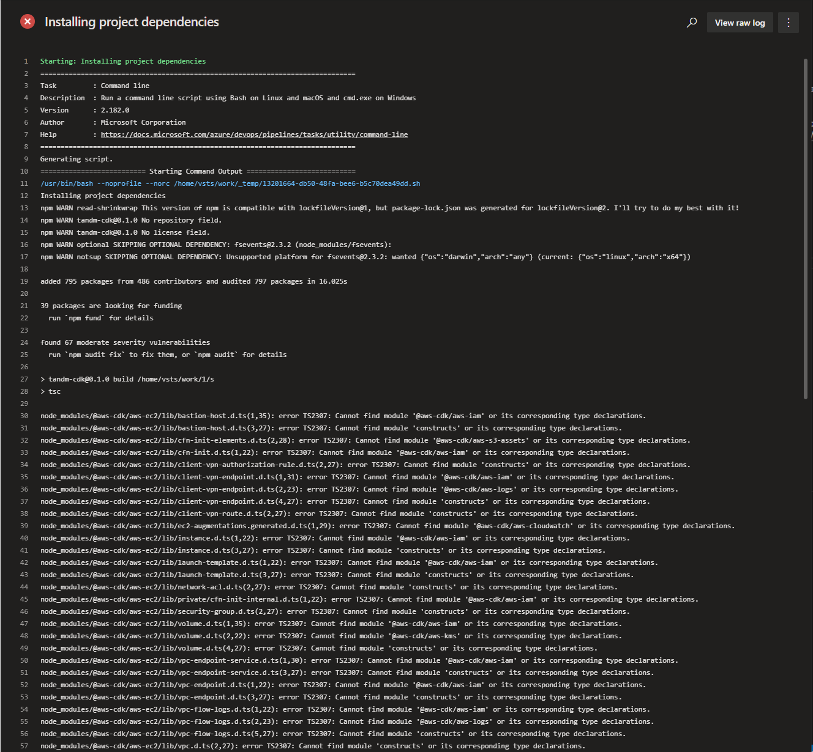
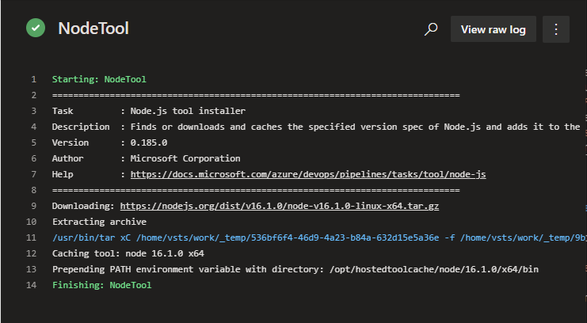
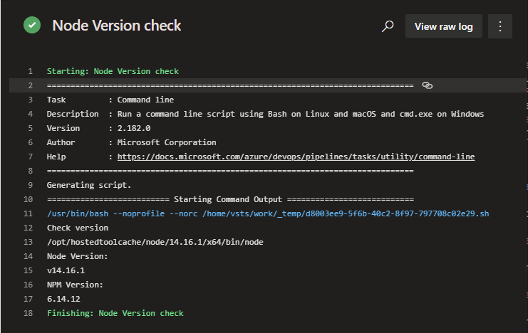

# Lesson learn with AWS CDK, Azure Pipeline

## Intro

As per requested at work to build a modulised, scalable infrastructure, I've been messing around the AWS CDK. It's quite a powerful tool to provision AWS infrastructure without touching the stupid ```yml``` file **_(Ya, it's you ```CloudFormation```)_.** However the process hasn't been smooth. Therefore, in this post, I just want to write down and summarise what I come across. **This is not a tutorial**. For that you got a great blog from ```Carlos``` [Provisioning resources on AWS using AWS CDK and Azure DevOps Pipelines](https://www.mytechramblings.com/posts/provisioning-aws-resources-using-cdk-azure-devops/).

---

## TL;DR

Simply put: 

> This version of npm is compatible with lockfileVersion@1, but package-lock.json was generated for lockfileVersion@2.

---

## The lesson

Let's look at all the errors...



The error occured when the build is executing a ```npm run build``` after ```npm install```.



The "Cannot find module" should've trigger some alarm bells in my head regarding the ```npm install```. Yet I went a big route to debug, look for ```node_modules```, whether that exists or not etc. 

And this line ```This version of npm is compatible with lockfileVersion@1, but package-lock.json was generated for lockfileVersion@2. I'll try to do my best with it!``` gives me a big impression that the ```npm install``` is totally fine. 

Plus, ```AWS CDK``` has been giving me problems. When they got a new release, I need to go the ```package.json``` to upgrade all my ```cdk``` modules, otherwise, builds fail, nothing works. 

After a while, I still could not have any clue of what is going on, I tried run this thing on my ```WSL``` since it's running on the Linux box, as my friend suggested. But the result is everything fine. 


### So what went wrong...

\
Finally, I noticed one of my debug command regarding my NPM VERSION

In my build script, I did put in a ```NodeTool@0```, which is provided by Azure Pipeline. And I specify the verison to ```16.x```. 

```yml
  - task: NodeTool@0
    inputs: 
      versionSpec: '16.x'
    displayName: "Install NodeJS"
```





Yet after I check my node version, it's still at 14.




I started getting frustrated, until I found this: [Ubuntu2004-README.md](https://github.com/actions/virtual-environments/blob/main/images/linux/Ubuntu2004-README.md) from [MS Hosted agent](https://docs.microsoft.com/en-us/azure/devops/pipelines/agents/hosted?view=azure-devops&tabs=yaml). 

The ```ubuntu-latest``` image that I'm using got pre-installed ```NodeJS 14.x```. And the ```NodeTool@0``` does not change anything for the build agent. 

And this [aws-cdk issue](https://github.com/aws/aws-cdk/issues/13541) confirms my error was on the difference of my ```npm``` version on build agent and my local npm version that generated my ```package-lock.json```.

Shamail (from the above github issue) has a good enough explanation of what happend: 


> "My issue was due to the default codebuild image using npm v6.x instead of npm v7.x, which i'm using locally and which produces a lockfileVersion:2 instead of lockfileVersion:1 package-lock.json file. So when codebuild pulls the code from my repo, it's getting a package-lock.json that isn't compatible with npm v6.x but it tries to use it anyway without throwing a mismatch error."

\
Once I done a force delete of my ```package-lock.json```, my problem resovled. 
